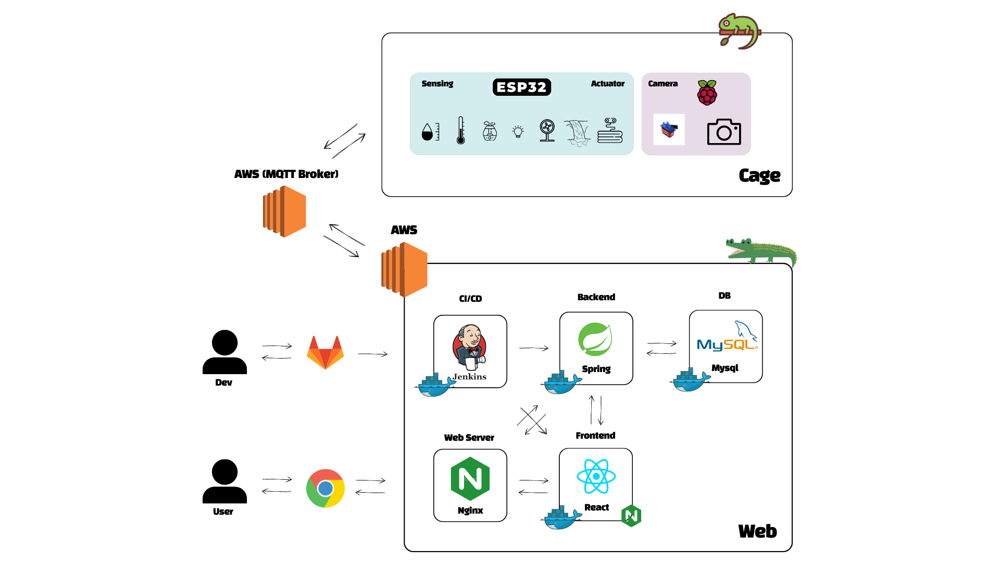

# 공통프로젝트!

# 🦎 파충류치원

## **0️⃣ 프로젝트 개요**

🎈 프로젝트명 : 파충류치원

📌 프로젝트 컨셉 : Web IoT를 활용한 스마트 파충류 케이지

🛠 개발 기간 : 23.07.10 ~ 23.08.18 (6주)

🧑🏻 팀원 : 인정환, 김민태, 김한주, 손세이, 조윤상

💻 사용 기술스택 : SpringBoot, React, AWS + (4. 시스템 아키텍처 참고)

## **1️⃣ 팀원 정보 및 업무 분담 내역**

| 이름            | 역할     | 설명                                                                                                                                                                          |
| --------------- | -------- | ----------------------------------------------------------------------------------------------------------------------------------------------------------------------------- |
| 인정환 (팀장)   | IoT      | RPI4 코드 구현                                                                                                                                                                |
| 김민태 (부팀장) | Backend  | Backend Entity 및 API 구현<br />Figma 제작<br />ERD 설계                                                                                                                      |
| 김한주          | Frontend | React와 TypeScript를 활용한 Frontend 구현<br />Zustand를 활용한 상태 관리 구현<br />Figma 제작<br />ERD 설계                                                                  |
| 손세이          | IoT      | ESP32 코드 구현 <br />Jira 관리<br />UCC 제작                                                                                                                                 |
| 조윤상          | Backend  | Docker 및 Jenkins를 활용한 CI/CD 구축<br />Docker 및 AWS EC2를 활용한 서버 배포<br />Nginx를 활용한 Web Server 구축 및 Reverse Proxy 설정<br />JWT 발급 및 인증<br />ERD 설계 |

## **2️⃣ 서비스 대표 기능**

- 웹

  | 기능               | 세부기능                                                                                                               |
  | ------------------ | ---------------------------------------------------------------------------------------------------------------------- |
  | 회원 기능          | - 회원가입 / 로그인 / 로그아웃<br />- 회원정보 변경 및 탈퇴                                                            |
  | 프로필             | - 사용자 정보 조회<br />- 파충류 정보 조회                                                                             |
  | 케이지 상태 조회   | - 케이지 온도 / 습도 / UV 등 표시<br />- 실시간 영상 송출<br />- 카메라 위치 조종<br /><u>- 영상 캡쳐 후 사진 저장</u> |
  | 케이지 상태 조절   | - 케이지 온도 / 습도 / UV 등 환경 설정                                                                                 |
  | 파충류별 정보 등록 | - 동물의 종류 등록<br />- 종류별 가이드라인 제공                                                                       |
  | 먹이 주기 알림     | - 먹이를 제공하는 시간에 맞춰 알림<br />- 먹이 주기 입력                                                               |
  | 물품 판매처 제공   | - 판매처 연결                                                                                                          |

- 디스플레이

  | 기능             | 세부기능                                      |
  | ---------------- | --------------------------------------------- |
  | 케이지 연동      | 부착된 케이스와 연동                          |
  | 케이지 상태 표시 | 현재 케이지 내부 온도 / 습도 / UV on/off 표시 |
  | 케이지 상태 조절 | 현재 케이지 온도 / 습도 / UV 변경             |

- IoT

  | 기능        | 세부 기능                                            |
  | ----------- | ---------------------------------------------------- |
  | 온습도 센싱 | DHT 센서로 온습도를 측정 후 mqtt 통신으로 값 전달    |
  | 영상 송출   | Pi Camera를 통한 실시간 영상 송출                    |
  | 조명 유지   | LED, 온열패드로 조명 유지                            |
  | 온도 유지   | 팬과 온열 패드로 온도 유지                           |
  | 습도 유지   | 가습기 모듈을 이용하여 습도 조절                     |
  | 폭포        | 워터 펌프 모터를 활용하여 흐르는 폭포 구현           |
  | H/W         | 프레임 만들기                                        |
  |             |                                                      |
  | 추가 기능   | 파충류 detect해서 카메라 자동 무빙                   |
  |             | 조작(온열패드, 쿨링팬, 가습기 모듈) → qt or node-red |
  |             | 고장 여부 알림                                       |

## 3️⃣ 서비스 화면

| 기능             | 세부기능                                      |
| ---------------- | --------------------------------------------- |
| 케이지 연동      | 부착된 케이스와 연동                          |
| 케이지 상태 표시 | 현재 케이지 내부 온도 / 습도 / UV on/off 표시 |
| 케이지 상태 조절 | 현재 케이지 온도 / 습도 / UV 변경             |

## 4️⃣ 시스템 아키텍처 및 개발 환경

🌐 공통

| 상세               | 내용              |
| ------------------ | ----------------- |
| GitLab             | 형상 관리         |
| Jira               | 일정 및 이슈 관리 |
| Mattermost         | 커뮤니케이션      |
| Notion             | 일정 및 문서 관리 |
| IntelliJ           | IDE (2022.02)     |
| Visual Studio Code | IDE               |

📱 FrontEnd

| 상세             | 버전   |
| ---------------- | ------ |
| React            | 5.0.1  |
| zustand          | 4.3.9  |
| react-router-dom | 6.14.2 |
| TypeScript       | 5.1.6  |

💾 BackEnd

| 상세       | 버전    |
| ---------- | ------- |
| JDK(Zulu)  | 11.0.19 |
| SpringBoot | 2.7.13  |
| Gradle     |         |
| JWT        |         |

⛏ IoT

| 상세         | 버전              |
| ------------ | ----------------- |
| Arduino      | Arduino IDE 2.1.1 |
| Raspberry Pi | rasbian os 32bit  |

</br>

- System Architecture



## 5️⃣ 컴포넌트 구조 및 프로토타입

📱 FrontEnd

```
📄 .gitignore
📄 babel.config.js
📄 jsconfig.json
📄 package-lock.json
📄 package.json
📄 README.md
📄 vue.config.js
📂 node_modules
📂 public
    ㄴ📄 favicon.ico
    ㄴ📄 index.html
📂 src
    ㄴ📄 App.vue
    ㄴ📄 main.js
    ㄴ📂 assets
    ㄴ📂 components
        ㄴ📄 HomeContent.vue
        ㄴ📂 cals
        ㄴ📄 CalCreate.vue
        ㄴ📄 CalDetail.vue
        ㄴ📄 CalDietCreate.vue
        ㄴ📄 CalDietDetail.vue
        ㄴ📄 CalList.vue
    ㄴ📂 common
        ㄴ📄 AsideNav.vue
    ㄴ📂 posts
        ㄴ📄 PostsCreate.vue
        ㄴ📄 PostsDetail.vue
        ㄴ📄 PostsList.vue
    ㄴ📂 users
        ㄴ📄 UsersInfo.vue
        ㄴ📄 UsersLogin.vue
        ㄴ📄 UsersModify.vue
        ㄴ📄 UsersRegister.vue
        ㄴ📄 UsersSearch.vue
    ㄴ📂 router
        ㄴ📄 index.js
    ㄴ📂 store
        ㄴ📄 store.js
    ㄴ📂 modules
        ㄴ📄 commentModule.js
        ㄴ📄 dietModule.js
        ㄴ📄 followModule.js
        ㄴ📄 nightmodeModule.js
        ㄴ📄 postModule.js
        ㄴ📄 routineModule.js
        ㄴ📄 userModule.js
    ㄴ📂 util
        ㄴ📄 http-common.js
    ㄴ📂 views
        ㄴ📄 CalView.vue
    ㄴ📄 HomeView.vue
    ㄴ📄 PostsView.vue
    ㄴ📄 UserView.vue
```

💾 BackEnd

```
📂 src/main/java
    ㄴ📦 com.griter
        ㄴ📄 GriterApiApplication.java
    ㄴ📦 com.griter.config
        ㄴ📄 DBConfig.java
        ㄴ📄 SwaggerConfig.java
        ㄴ📄 WebConfing.java
    ㄴ📦 com.griter.controller
        ㄴ📄 CommentLikeRestController.java
        ㄴ📄 CommentRestController.java
        ㄴ📄 DietRestController.java
        ㄴ📄 FollowRestController.java
        ㄴ📄 ImageRestController.java
        ㄴ📄 PostLikeRestController.java
        ㄴ📄 PostRestController.java
            ㄴ📄 RoutineRestController.java
        ㄴ📄 UserRestController.java
    ㄴ📦 com.griter.exception
        ㄴ📄 PostNotFoundException.java
    ㄴ📦 com.griter.interceptor
        ㄴ📄 JwtInterceptor.java
    ㄴ📦 com.griter.model.dao
            ㄴ📄 CommentDao.java
        ㄴ📄 CommentLikeDao.java
        ㄴ📄 DietDao.java
        ㄴ📄 FollowDao.java
        ㄴ📄 ImageDao.java
        ㄴ📄 PostDao.java
        ㄴ📄 PostLikeDao.java
        ㄴ📄 RoutineLikeDao.java
        ㄴ📄 UserDao.java
        ㄴ📦 com.griter.model.dto
        ㄴ📄 Comment.java
        ㄴ📄 CommentLike.java
        ㄴ📄 Diet.java
        ㄴ📄 Follow.java
        ㄴ📄 Image.java
        ㄴ📄 Post.java
        ㄴ📄 PostLike.java
        ㄴ📄 Routine.java
        ㄴ📄 User.java
        ㄴ📦 com.griter.model.service
        ㄴ📄 CommentLikeService.java
        ㄴ📄 CommentLikeServiceImpl.java
        ㄴ📄 CommentService.java
        ㄴ📄 CommentServiceImpl.java
        ㄴ📄 DietService.java
        ㄴ📄 DietServiceImpl.java
        ㄴ📄 FollowService.java
        ㄴ📄 FollowServiceImpl.java
        ㄴ📄 ImageService.java
        ㄴ📄 ImageServiceImpl.java
        ㄴ📄 PostLikeService.java
        ㄴ📄 PostLikeServiceImpl.java
        ㄴ📄 PostService.java
        ㄴ📄 PostServiceImpl.java
        ㄴ📄 RoutineService.java
        ㄴ📄 RoutineServiceImpl.java
        ㄴ📄 UserService.java
        ㄴ📄 UserServiceImpl.java
📂 src/main/resources
    ㄴ📂 mappers
        ㄴ📄 Comment.xml
        ㄴ📄 CommentLike.xml
        ㄴ📄 Diet.xml
        ㄴ📄 Follow.xml
        ㄴ📄 Image.xml
        ㄴ📄 Post.xml
        ㄴ📄 PostLike.xml
        ㄴ📄 Routine.xml
        ㄴ📄 User.xml
    ㄴ📄 application.properties
    ㄴ📄 schema.sql
📄 pom.xml
```

⛏ IoT

## 6️⃣ 데이터베이스 모델링 (ERD)

- 나중에 추가

## 7️⃣ Convention

### Commit Convention

> [type] #(Jira issue number) commit message

- Type
  - **Fix** : 잘못된 동작을 고칠 때

    > fix function/error/typo in style.css

  - option
    - funtion : 고친 함수 명 (e.g. fix login function in index.html)
    - error : 수정한 에러 (e.g. fix [구체적 에러명] error in login.js)
    - typo : 오타 (e.g. fix typo in style.css)
  - **Add** : 새로운 것을 추가할 때

    > add mytest.test for test (새로운 파일 추가 시)

    > add blue color to style.css (기존 파일에 내용 추가 시)

  - **Move** : 코드나 파일을 이동할 때

    > move A to B (e.g. A를 B로 이동할 때)

  - **Rename** : 이름 변경이 있을 때

    > rename A to B (e.g. A를 B로 이름을 변경할 때)

  - **Update** : 정상적으로 동작하는 파일을 보완하는 경우

    > update test.js to use HTTPS (test.js에 기존의 프로토콜에서 HTTPS 프로토콜 사용으로 변경)

  - **Remove** : 삭제가 있을 때

    > remove test.js (파일 삭제 시)

    > remove black color from style.css (파일 내 부분 삭제 시)
- commit message: 변경 사항에 대해 명확하게 기술

### Code Convention

- JavaScript
- Java
- IoT

## 8️⃣ Git Flow

```
master
└ develop
  ├ feature-front
  ├ feature-back
  ├ feature-iot
  └ feature-log
```

- master : 운영 서버로 배포하기 위한 브랜치
- develop : 다음 출시 기능을 개발하는 브랜치
- feature : 세부 기능을 개발하는 브랜치

## **9️⃣ 회고**

| 이름                                                                                                                                              | 내용                       |
| ------------------------------------------------------------------------------------------------------------------------------------------------- | -------------------------- |
| <a href="https://github.com/jeonghwanin"></br>인정환 | 인정환ㅁㄴㅇㄻㄴㅇㄹ       |
| <a href="https://github.com/minsoon025"></br>김민태 | 김민태ㅁㄴㅇㄻㄴㅇㄻㄴ     |
| <a href="https://github.com/Koneweekk"></br>김한주  | 김한주ㅇㄻㄴㅇㄻㄴㅇㄹ     |
| <a href="https://github.com/seyi103"></br>손세이     | 손세이ㅁㄴㅇㄻㄴㅇㄹ       |
| <a href="https://github.com/younprize"></br>조윤상   | 조윤상ㅁㄴㅇㄻㄴㅇㄻㄴㅇㄹ |
